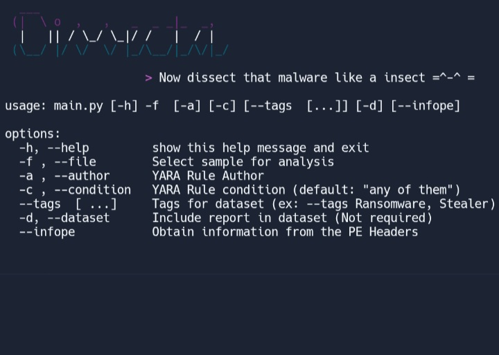

    

<h3 align="center">Dee-PE</h3>

    A simple <i>dissectool</i> to play and have fun statically with little <i>malware</i>. Only <b>PE/PE32+</b> format

## Documentation

See the official documentation [here](doc/README.md)

## Short description

### Reports

Generates a report in JSON format with the file in pieces (all possible IOCs).

**Features**:
- Metadata - (Name, File Size, Time Stamp, Machine, Others)
- Hash Sum - (md5, sha1, sha256)
- Readable strings
- URLs
- Sections - (VAddr, VSize, Data Size, Perms, Entropy)
- Imphash
- Executable sections opcodes
- WINDOWS API calls
- Imports

> PATH: ./reports/*.deep

### Dataset
Insert features into a dataset for future training of an ML model (to avoid data congestion avoid using the -d parameter if you are not sure about inserting it into the dataset).
> PATH: ./dataset/dataset.json
